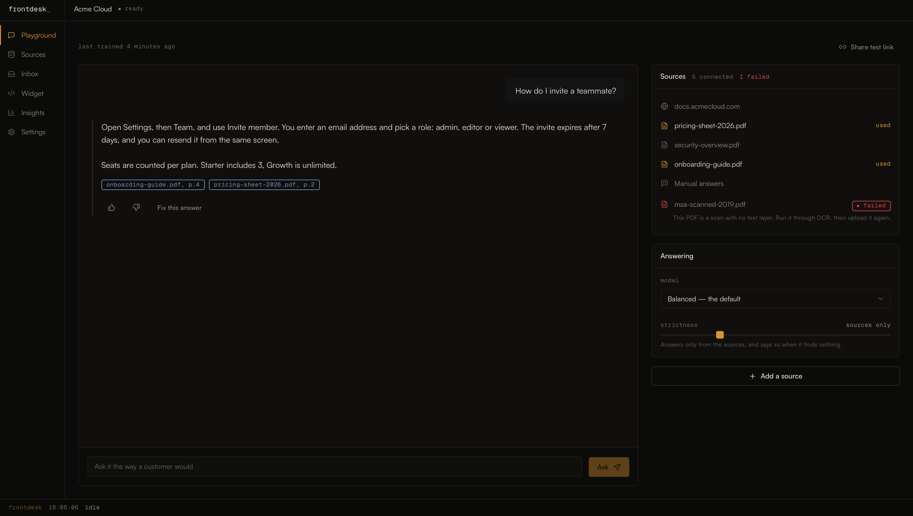

# Frontdesk

A support bot that answers from your own documentation, and shows the passage behind every answer.

**[Open the live site](https://nivoznuyk-blip.github.io/frontdesk/)** · **[Watch the walkthrough](https://drive.google.com/file/d/1UYIl5QUHa5p-mpAKGYJcDMtFS1F0YQCo/view?usp=sharing)**



---

## What's real and what's mocked

**Real.** Every route and every state. The fifteen screens in the sitemap are built, each with its
loading skeleton, empty state, and at least one error or edge case. The widget builder drives a live
preview on every keystroke and persists its settings to `localStorage`, so a colour you pick survives
a refresh and shows up on the demo page. Inbox filters, the retention boundary, and the plan gating
are computed rather than drawn: switch to Free in Settings and the page cap drops to 10, the paywall
appears in Sources where the limit is actually met, the badge toggle locks, and the inbox window
shrinks to seven days. Correcting a bad answer writes a real entry into the Manual answers source —
the page count on the Sources table goes up as you watch. Keyboard shortcuts, focus rings, reduced
motion and the responsive behaviour are all wired.

**Mocked.** The crawl is a timed sequence with fixed page counts. The bot answers from six scripted
question-and-answer pairs matched on loose keywords, and anything outside them gets the fallback:
it says it could not find the answer, names the closest document, and offers to take one from you.
File uploads report timed progress and derive a page count from the file size — a file with `scan`
in its name fails on purpose, so the OCR error state is reachable. Login accepts anything and goes
to the app. There is no checkout; changing plan is local state.

The brief asked for a clickable prototype, so the time went into product decisions and the states
around them rather than into a retrieval pipeline. A working RAG backend would have proved that
embeddings work, which is not in question. What is worth proving is what the product does when the
bot does not know something, what happens to a wrong answer after a customer sees it, and where the
paywall sits — and those are decisions, not infrastructure.

## Product decisions

**Onboarding reaches an answer before it asks for anything.** Point at a URL, watch the crawl, ask
the bot a question. Only after the answer arrives does a form appear, and it says *save this bot*,
not *create an account*. The account is the price of keeping something you already have, which is a
different conversation from the price of finding out whether this works at all.

**Every answer carries its sources, and an honest gap beats a plausible invention.** Answers end
with citation chips that expand the quoted passage in place, so checking one does not cost you the
conversation. When nothing matches, the bot says so, names the closest document it has, and offers
to take an answer from you. The strictness slider decides how far an answer may travel from the text
it found, and new bots start near the strict end. A support bot's failure mode is not silence — it is
a confident sentence your company never wrote, in front of a customer.

**A wrong answer closes a loop instead of filing a complaint.** Thumbs down opens a correction form
in the inbox, and what you write becomes a Manual answers entry the bot uses from the next question
on. The link to that source is shown explicitly, because the point of the feature is watching the
loop close, not trusting that it did.

**Insights answers one question instead of drawing three charts.** The main block is the questions
the bot could not answer, ranked by how often they came up, each with a button that opens the same
correction form. Working down that list is the whole maintenance job. There is no line chart, because
a line chart of conversation volume tells a support lead nothing they can act on this afternoon.

**Gating follows what grows with the value.** Pages indexed, answers per month, seats — the things
that go up as the bot becomes load-bearing. Paywalls appear where the limit is actually met, inline
and explained, naming what unlocks and what it costs. Removing our badge is on the first paid tier
because that is the moment the bot stops being an experiment and starts representing the company.

**Dark, warm, and amber rather than the usual violet.** Near-black plus a purple accent is where most
generated interfaces land. The black here is warm rather than neutral, and the accent is sodium amber
— the colour of an amber phosphor terminal, which belongs to the subject. Every number is monospace,
structure comes from hairlines instead of stacked cards, and the log line pinned to the bottom of the
shell runs through the whole product, from the crawl on the landing page to each setting change in
the builder. It reads as an instrument, which is what a support lead is actually operating.

## Running it locally

```bash
npm install
npm run dev                        # http://localhost:5173/frontdesk/
npm run build && npm run preview   # the production build, which is what to check layout against
```

Fonts are committed to `public/fonts/` — nothing to download. If you ever need to replace them:
Satoshi from [fontshare.com/fonts/satoshi](https://www.fontshare.com/fonts/satoshi), Geist Mono from
[vercel.com/font](https://vercel.com/font). Without them the interface falls back to system faces and
the type stops holding its rhythm.

One repo-specific command is worth knowing:

```bash
npm run audit:classes    # finds Tailwind classes that never made it into the built CSS
```

The spacing scale is deliberately sparse, so a reflexive `h-5` or `pr-20` compiles to nothing and
fails silently. The audit compares every class written in `src/` against the emitted stylesheet. It
has caught real regressions, including a config change that quietly disabled every `max-*` variant.

## Stack and layout

Vite, React 18 and TypeScript. Tailwind configured to read the CSS variables from `tokens.css`, so
colour lives in one file and nothing writes a raw hex outside it. Framer Motion for the animation,
all of it defined once in `lib/motion.ts`. React Router v6. Zustand for the small amount of shared
state, persisted to `localStorage`. lucide-react for icons. No backend, no API calls.

```
src/
  styles/tokens.css     colour, type, spacing, motion — the single source
  components/
    ui/                 Button, Input, Panel, Table, Badge, Modal, Toast, CodeBlock …
    layout/             marketing nav and footer, app shell, sidebar, the log line
    chat/               thread, message, citation chip, composer, streaming text
    widget/             launcher, preview, embed code, the working demo widget
    marketing/          hero terminal, live demo, widget lab
  mock/                 Acme Cloud: sources, conversations, insights, chat scripts, plans
  store/                sources, widget settings, plan, session log
  lib/                  formatting, keyword matcher, fake streaming, contrast, motion
  pages/
    marketing/          landing, pricing, docs, changelog, widget demo, login, 404
    app/                playground, sources, inbox, widget builder, insights, settings
    Onboarding.tsx      the three-step first run
```

`PRD.md` is what to build, `DESIGN.md` is how it should look, `CLAUDE.md` holds the conventions and
the build order. Deployed to GitHub Pages by Actions on every push to `main`.
